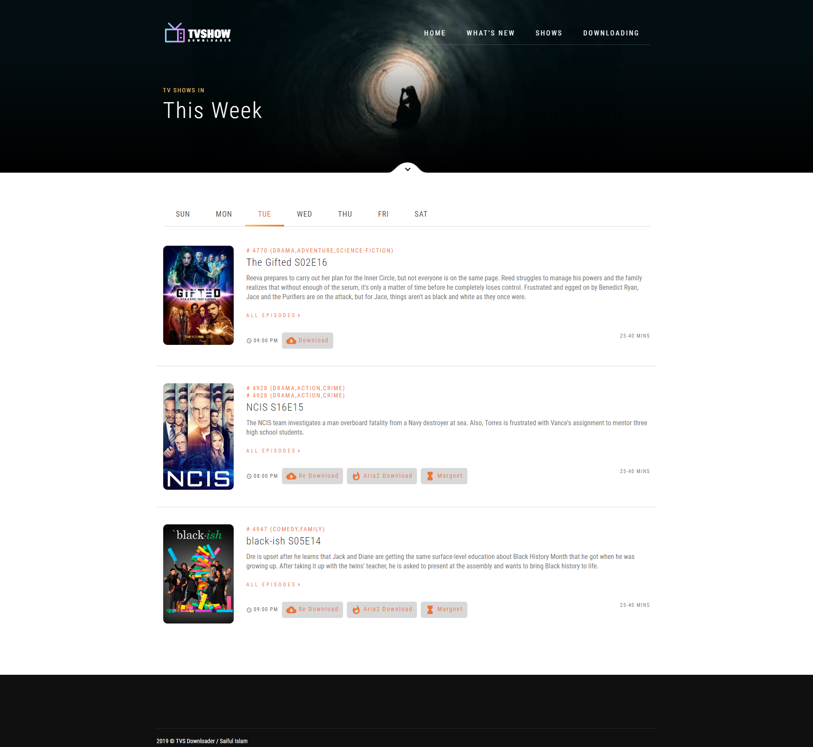

# TVShow Downloader

This is a simple web application for "Automatic TV Show Download". It's written in Laravel and use aria2 as torrent downloader. 

### Data Source
* kickass
* thepiratebay
* 1337x
* tvmaze

### Installation
1. Clone this project using git (`git clone https://github.com/saaiful/TVSHOW`) or download and unzip it in your server root.
2. Install it using `composer install`.
3. Edit the .env file and set your database details.
4. Migrate using `php artisan migrate`.
5. Install aria2 in your server/pc and enable rpc (`aria2c --enable-rpc --rpc-listen-all`), in windows x64 download the setup file from https://github.com/saaiful/aria2-win64-rpc/raw/master/aria2c-setup.exe and just install it and reboot your pc.
6. Set a cron job or set a task using windows task scheduler. 

All downloads can be found in `storage/downloads`.
